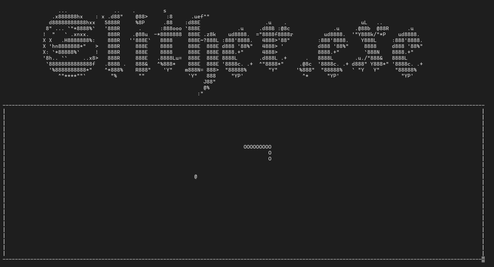

# Slither – Terminal Snake Game

**Slither** is a terminal-based Snake game implemented in C using the `ncurses` library. Navigate your snake, collect apples, and try not to crash!  

> **Note:** This game is designed to run on **Linux** systems only due to the use of the `ncurses` library.

## Features

- **Classic Snake Gameplay:**  
  Control a snake that moves across the terminal screen, eating apples to grow longer. Avoid running into yourself or the borders.  

- **Dynamic Board & Wrap-Around:**  
  The board is dynamically sized based on your terminal. When the snake reaches the edge of the board, it wraps around to the opposite side.

- **Random Apple Placement:**  
  Apples appear randomly on the board. Eating an apple grows the snake by one unit.

- **Keyboard Controls:**  
  - `Arrow Keys` – Move the snake in the corresponding direction.  
  - The snake cannot instantly reverse direction (e.g., moving left while going right).  

> **Tip:** Holding down an arrow key will make the snake move faster in that direction, effectively fast-forwarding the game.

- **Title & Death Screen:**  
  - A visually appealing ASCII art title is displayed at the start.  
  - When the snake dies, a detailed “You Died” splash screen is shown.

## Screenshots

**Playthrough:**



**Death Screen:**


## How to Compile & Run

1. **Open a terminal** and navigate to the directory containing `snake.c`.  
2. **Compile the game** using GCC with the `ncurses` library:

   ```bash
   gcc snake.c -lncurses -o slither.exe
   ```
3. **Run the program** and enjoy snaking:

  ```bash
  ./slither.exe
  ```

## Potential Enhancements

* **Multiplayer Mode:**  
  Add support for two snakes controlled by separate keys for competitive or cooperative gameplay.

* **Difficulty Levels:**  
  Increase snake speed over time or add obstacles on the board.

* **Score Tracking:**  
  Display the current score and high score on the screen.

* **Sound Effects:**  
  Add terminal beeps or system notifications when eating apples or dying.

* **Custom Boards:**  
  Support for different board sizes or shapes.

